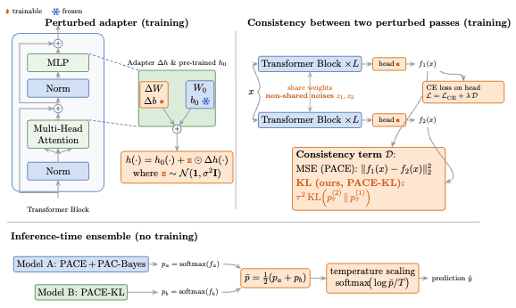

# Uncertainty-Guided LoRA Adaptation of Vision Transformers

<p align="center">
  
</p>

<p align="center">
  <a href="https://scholar.google.com/citations?user=NiUDAvIAAAAJ&hl=en">Vasileios Papageridis</a> ·
  <a href="https://scholar.google.com/citations?user=p5hq1OAAAAAJ&hl=en">Bhalaji Nagarajan</a> ·
  <a href="https://scholar.google.com/citations?user=bLc4qKsAAAAJ&hl=en">Montse Pardàs</a> ·
  <a href="https://scholar.google.com/citations?user=p_MCjd4AAAAJ&hl=en">Petia Radeva 4</a>
</p>

This repository contains the vision code and curated reproducibility artifacts for the thesis
**“Uncertainty-Guided LoRA Adaptation of Vision Transformers.”**

The project studies calibration and uncertainty in LoRA-adapted ViT-B/16 models. Starting from the
PACE codebase, it evaluates raw-logit consistency, probability-space KL consistency, uncertainty
guided sample selection, PAC-Bayes adapter-output noise, IVON-LoRA weight-space uncertainty,
temperature scaling, controlled distribution shifts, and inference-time probability ensembles.

## Main Claim

Raw-logit PACE improves adaptation but can compress logits and produce underconfidence. Moving the
consistency objective into probability space with PACE-KL substantially improves calibration before
post-hoc correction, while PAC-Bayes and ensemble variants provide complementary uncertainty
controls on harder datasets.

<details>
<summary><strong>Repository Layout</strong></summary>

```text
train.py                         main training entrypoint
evaluate_all_metrics.py          single-model metrics, TS, shift/OOD, IVON MC evaluation
evaluate_two_model_ensemble.py   probability/log-prob ensemble evaluation
aggregate_results.py             aggregate JSON result files
run_main_experiments.sh          configurable experiment runner
pace/                            adapters, PACE losses, PAC-Bayes, IVON, Bayesian-LoRA
utils/                           VTAB/few-shot data loading and helpers
runners/                         focused experiment runners
configs/                         shell-env configs for thesis runs and sweeps
plotting/                        reusable plotting scripts
results/                         curated lightweight CSVs and figures
docs/                            reproducibility, mapping, and artifact documentation
tests/                           smoke/unit tests
```

The layout intentionally stays close to upstream PACE instead of migrating into a new `src/` tree,
so existing training and evaluation commands remain valid.

</details>

## Methods Implemented

| Thesis name | Code/config name | Description |
| --- | --- | --- |
| LoRA | `baseline`, `lora` | Frozen ViT-B/16 with trainable adapters and head. |
| PACE | `pace` | Raw-logit MSE consistency. |
| PACE-OF | `pace_offset` | Offset-free MSE diagnostic branch. |
| PACE-KL | `pace_kl_t1`, `pace_kl_t2` | Probability-space KL consistency. |
| PACE-KL + Margin | `pace_kl_margin_t1` | KL consistency with margin regularization. |
| PACE + PAC-Bayes | `pace_pacbayes` | Learned adapter-output perturbation/noise. |
| PACE-KL + PAC-Bayes | `pace_kl_pacbayes_t1` | KL consistency plus PAC-Bayes adapter noise. |
| Uncertainty soft/top-k | `pace_uncert_*`, `pace_kl_uncert_*` | Consistency selection/weighting by predictive uncertainty. |
| PACE + IVON-LoRA | `pace_ivon` | IVON optimizer posterior over additive LoRA weights. |
| PACE-KL + IVON-LoRA | `pace_kl_ivon_t1`, `pace_kl_ivon_t2` | KL consistency plus IVON-LoRA. |
| Ensemble | `evaluate_two_model_ensemble.py` | Inference-time probability averaging. |

See [`docs/method_mapping.md`](docs/method_mapping.md) for the full method-to-code map.

<details>
<summary><strong>Installation and Data</strong></summary>

## Installation

```bash
pip install -r requirements.txt
```

The main experiments were run with CUDA on an NVIDIA RTX 3090. CPU/MPS execution is suitable for
small checks only, not the full 300-epoch grids.

## Pretrained Backbone

Download the ImageNet-21k ViT-B/16 checkpoint used by the original PACE codebase:

[ViT-B_16.npz](https://storage.googleapis.com/vit_models/imagenet21k/ViT-B_16.npz)

Place it at the repository root:

```text
ViT-B_16.npz
```

The checkpoint is ignored by Git.

## Data

Place VTAB-1k and few-shot datasets under `data/`, following the original PACE/NOAH layout:

```text
data/
  vtab-1k/
    cifar/
    caltech101/
    dtd/
    svhn/
    oxford_flowers102/
    oxford_iiit_pet/
```

Large datasets are ignored by Git. See [`data/README.md`](data/README.md).

</details>

<details>
<summary><strong>Reproducing Thesis Runs</strong></summary>

The runners use shell environment variables. Source a config, then call the existing runner.

Main primary datasets:

```bash
set -a
source configs/thesis_runs/main_primary.env
set +a
bash run_main_experiments.sh
```

Uncertainty-guided runs:

```bash
set -a
source configs/thesis_runs/uncertainty_guided_main.env
set +a
bash runners/run_uncertainty_guided_experiments.sh
```

Single-model held-out temperature-scaling control:

```bash
set -a
source configs/thesis_runs/single_model_tssplit.env
set +a
bash runners/run_single_model_tssplit_main_june26.sh
```

More commands are documented in [`docs/reproduce_thesis_results.md`](docs/reproduce_thesis_results.md).

</details>

<details>
<summary><strong>Evaluation and Ensembling</strong></summary>

Evaluate a checkpoint:

```bash
python evaluate_all_metrics.py \
  --checkpoint outputs/main_primary/your_run/weight.pt \
  --dataset cifar \
  --adapter LoRAmul_VPTadd \
  --posthoc_temp_scaling \
  --temperature_protocol split \
  --save_dir results/eval
```

Aggregate JSON results:

```bash
python aggregate_results.py --results_dir results/eval
```

Evaluate a two-model ensemble:

```bash
python evaluate_two_model_ensemble.py \
  --checkpoint_a outputs/model_a/weight.pt \
  --label_a PACE_PACBayes \
  --pacbayes_a \
  --checkpoint_b outputs/model_b/weight.pt \
  --label_b PACEKL_uncert_topk \
  --dataset cifar \
  --adapter LoRAmul_VPTadd \
  --rank 10 \
  --sigma 1.2 \
  --posthoc_temp_scaling \
  --temperature_protocol split \
  --save_dir results/ensemble \
  --plot_dir outputs/plots/ensemble
```

</details>

<details>
<summary><strong>Tables, Figures, and Tests</strong></summary>

Curated lightweight table/figure artifacts live in:

```text
results/tables/
results/figures/
```

List and verify them:

```bash
bash scripts/export_thesis_tables.sh
bash scripts/check_artifact_inventory.sh
```

See [`docs/results_inventory.md`](docs/results_inventory.md) for the mapping from included artifacts
to thesis sections.

## Tests

```bash
pytest tests
```

Compile the main files:

```bash
python -m py_compile \
  train.py \
  evaluate_all_metrics.py \
  evaluate_two_model_ensemble.py \
  aggregate_results.py \
  pace/pace_ops.py \
  pace/residual_adapters.py
```

</details>

## Known Limitations

- Large checkpoints and datasets are not included.
- The main PACE/PAC-Bayes/KL runs use `LoRAmul_VPTadd`; IVON-LoRA uses additive `LoRAadd` because IVON places a posterior over trainable LoRA weights.
- Some branches are diagnostic or exploratory and are not part of the headline thesis pipeline.
- The upstream PACE repository is MIT-licensed; the license text and upstream copyright notice are included in `LICENSE`, with provenance details in `LICENSE_NOTICE.md`.

## Citation

If you use this code, cite the original methods corresponding to the components you use. Full BibTeX
entries are in [`CITATIONS.md`](CITATIONS.md).

Key references include PACE, LoRA, VPT, ViT, PAC-tuning/PAC-Bayes, IVON-LoRA, Bayesian-LoRA,
temperature scaling, deep ensembles, and uncertainty under dataset shift.

## Acknowledgements

This repository is based on the official PACE vision codebase:

[MaxwellYaoNi/PACE](https://github.com/MaxwellYaoNi/PACE/tree/main/Vision)

The adapter and PACE training infrastructure follow the original repository, while the
uncertainty-guided, PAC-Bayes, IVON-LoRA, Bayesian-LoRA, shift/OOD, ensemble, calibration, plotting,
and reproducibility extensions were added for this thesis.
